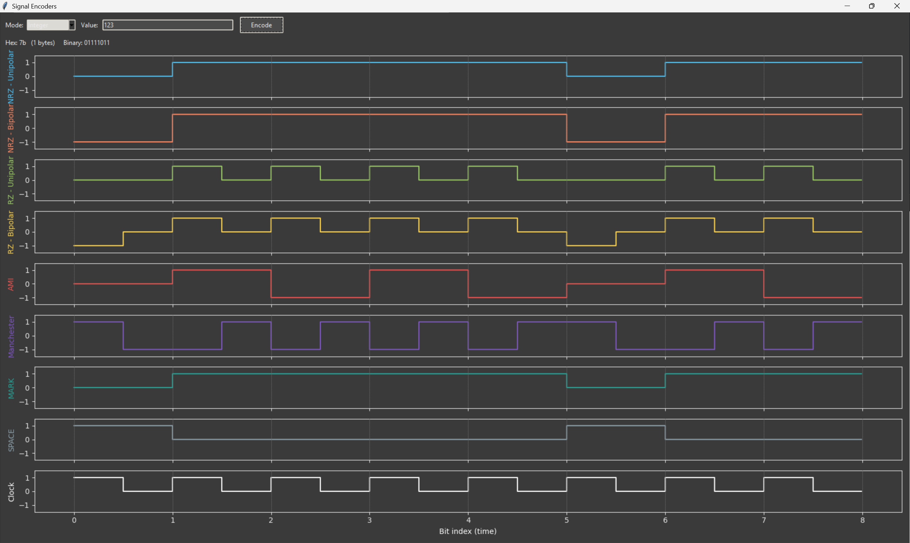

SignalEncoders
================

Small Tkinter GUI to convert a number or raw bytes into bits and visualize common line encodings.

Features
- Input modes: Integer, Hex Bytes, Binary
- Byte conversion (big-endian minimal) and MSB-first bit expansion
- Visualizations for: NRZ (unipolar & bipolar), RZ (unipolar & bipolar), AMI, Manchester, MARK, SPACE, and a Clock reference
- Distinct color per signal and vertical bit-division lines drawn on top for clarity
- Lightweight dark/grey UI theme
- Fullscreen-friendly layout (F11 to toggle fullscreen, Escape to exit)

Requirements
- Python 3.8+
- matplotlib
- numpy

Quick start
1. (Optional) Create & activate a virtual environment:
   python -m venv .venv
   .\.venv\Scripts\activate

2. Install dependencies:
   pip install -r requirements.txt

3. Run the app:
   python app.py

Usage
- Choose input Mode (Integer, Hex Bytes, Binary) and enter a value in the Value field.
  - Integer examples: 305419896 or 0x1234
  - Hex Bytes examples: 1a2b3c, 1a 2b 3c, 0x1a 0x2b, 1A:2B:3C
  - Binary examples: 01010110, 101 010
- Click Encode to update the hex/binary text and the plots.
- Press F11 to toggle fullscreen or Escape to exit fullscreen.

Notes
- Hex and binary inputs are tolerant of common separators and optional prefixes.
- The Clock subplot is an independent square-wave reference toggling at half-bit intervals.
- If matplotlib/numpy are not installed the GUI runs but plotting is disabled and an informational message is shown.

License / Attribution
- This is a small utility script provided as-is for educational/demo purposes.

Contact
- No contact information included. Modify README as needed.
